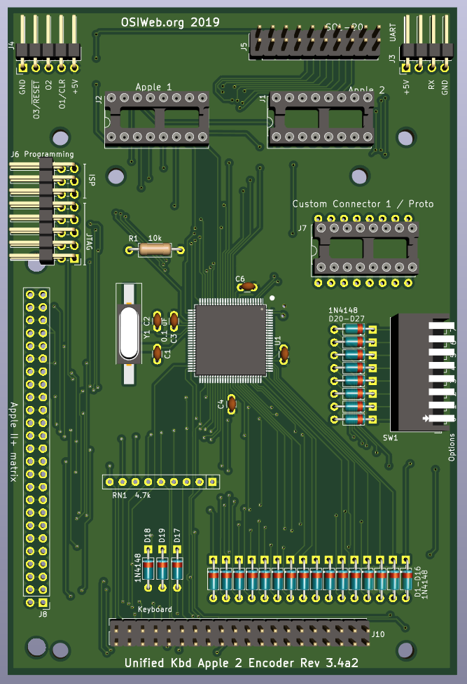

# Apple II/II+ Encoder

This is a version of the ASCII interface wired up to be compatible with the
Apple II/Apple II+ keyboard matrix. This board was broken out as a separate PCB
from the Atmega2560-based interface board on which it was based, in order to
keep the "custom" connector customizable on that board.

This board is otherwise identical to rev 3.4 of the ATMega2560-based ASCII interface board, and shares the same firmware and features.

## Features
- Parallel or serial output
- Up to 8 configuration settings via an up-to-8 position DIP switch
- Apple 1, Apple 2, and SOL-20 compatible outputs. Other configurations can be
  supported by making a custom cable.
- Can decode arbitrary keyboards up 16 rows by 8 columns.
- Supports up to 3 keyboard LEDs
- Supports up to 3 "special" host outputs, such as RESET, SCREEN_CLEAR, BREAK, etc.
- Socket for custom connector

## Assembly Notes

- You may build this board as if it is a general purpose ASCII interface. In
   that case, you may want to avoid installing the 1x25 Apple2 keyboard header
   if it interferes with the target keyboard matrix. 
   
- This encoder is normally used with keyboards that have a diode per key.  For use 
with a key  matrix with no diodes (such as the Apple 2 key matrix), cut the PCB 
traces that short diodes D1-16, and install D1-16.

- If you ARE building this board as an Apple 2 encoder, then you may OMIT:

    - Sol-20 connector J5
    - Custom connector J7
    - D17,D18,D19 - These are used for the "classic" keyboard matrix.
    - D7,D8,D15,D16 - These are diodes for rows 12-15, which are not used.
    - The serial out connector J3 if you do not plan to use a serial output.
    - The I/O connector J4, as all the I/O lines are routed through the
       keyboard connector.
    - If you will be using the keyboard with only an Apple 1 or Apple 2, then
       you do not need to install both the Apple 2 connector (J1) AND the Apple
       1 connector (J2). You may install only the one you plan to use, and
       reduce the risk of plugging into the wrong socket (and possibly damaging
       the encoder).
    
1. Solder the surface-mount microcontroller first. Be sure to match pin 1 to the
   dot on the silk-screen layer.
1. Next, install the surface mount crystal, Y1.  The orientation is not important.
1. Next, solder in the resitor R1
1. Install all the capacitors. Be sure to separate out the two capacitors for the XTAL 
   circuit from the other capacitors, the rest of which are 0.1uF bypass capacitors.
1. Install the In-circuit Serial Programming (ISP) header, J6. (right-angle, 2x3
   0.100")
1. If you will be using the Apple 1 connector, install the DIP socket J1 (16-pin
   dip). If you plan to insert and remove the cable many times, a dual-wipe
   socket may be preferable to machine-pin, since it has a lower insertion
   force, and you will be less likely to bend pins. If you plan to insert the
   cable once and leave it forever, I suggest a machine-pin DIP socket.
1. If you will be using the Apple 2 connector, install the DIP socket J2 (16-pin
   dip).  The note for the Apple 1 connector selection applies here as well.

