# Keyboard build notes
## Preparing the Keyboard PCB
## Preparing the Aligner
## Combining the PCB and aligner
### The Spacebar Stabilizer
#### Cherry MX keys
##### Stabilizer hardware
The keyboard is designed to accommodate PCB-mounted Cherry-MX compatible Spacebar aligner hardware.  Most standard aligner kits come with pre-bend rods for a 6.25u spacebar.  Since the 8u spacebar in the retro-keyboards, you will need to bend your own rod.  I have included some sources for the rods below (1).
##### Bending the stabilizer rod
The aligner PCB includes a guide for bending the stabilizer.

1. Start by creating a 90 degree bend about 2 cm from the end of the rod.  This allows enough room to clip the end down to the correct length later.

    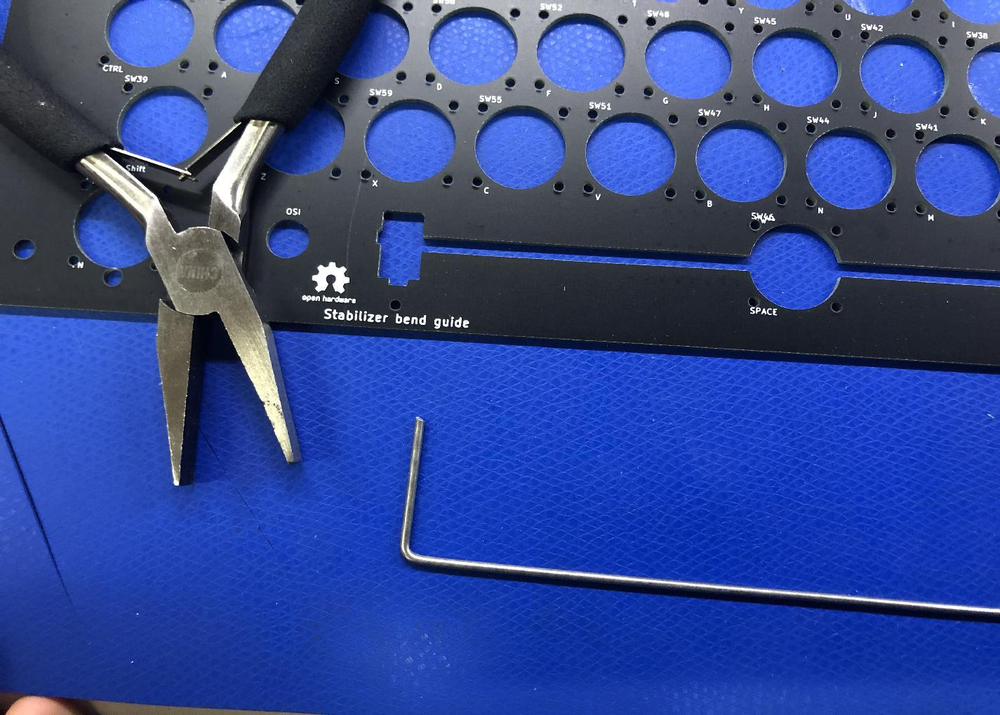

1. Insert the bent end into one guide hole, and, keeping the rod as flat to the board as possible, use the second guide hole to estimate the position of the second bend.  Your estimate should be about 1mm short to allow for a bending radius.  Once you have the pliers positioned on the rod, make your 90 degree bend.

    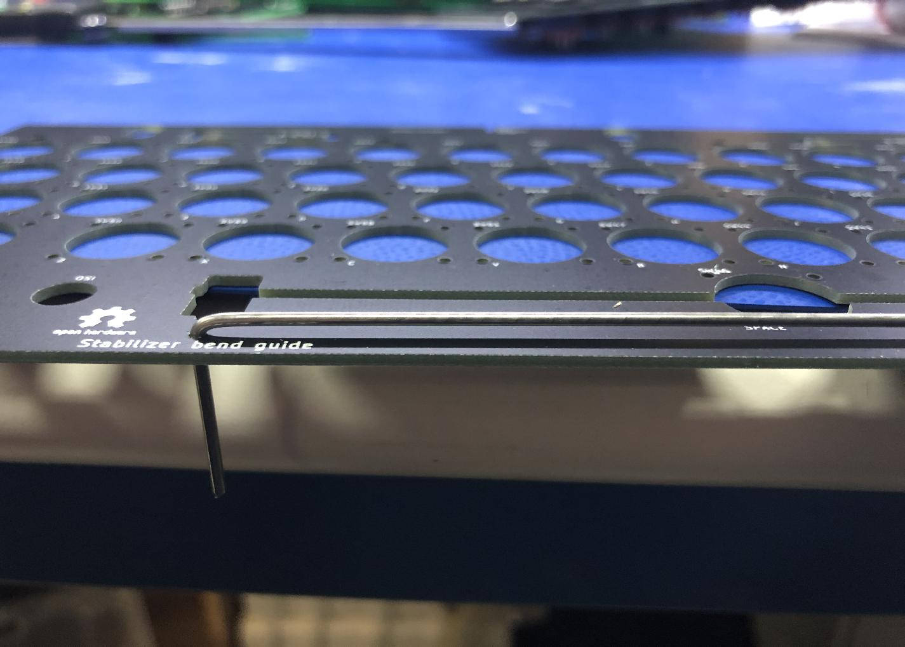

1. Look along the length of the rod to make sure that both "arms" are in line.  If necessary, align the two arms by twisting about the axis of the axis of the rod.

1. Test the fit of the rod by inserting it into the guide holes.  Adjust as needed.

    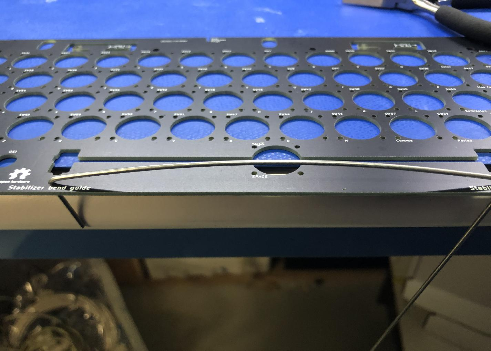

1. Clip the arms of the rod to about 11 mm.

    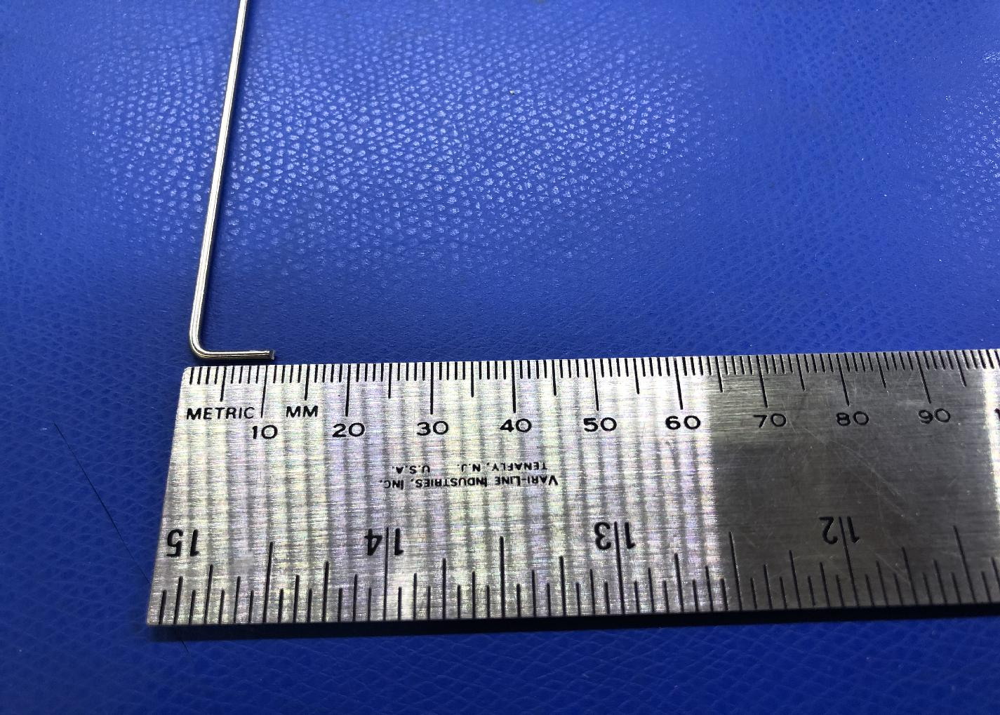

1. Install the Cherry MX stabilizers to the board.

1. Install the spacebar and insert the rod.

#### Futaba MD4-PCS keys
##### Stabilizer hardware
See the Cherry MX section above for notes on installing the Cherry MX stabilizer hardware and bending the spacebar stabilizer rod.

##### Longer Stabilizer posts for Futaba

The Futaba aligner PCB includes two stabilizer posts, allowing the futaba keys to be used with the Cherry MX PCB-mount stabilizers.

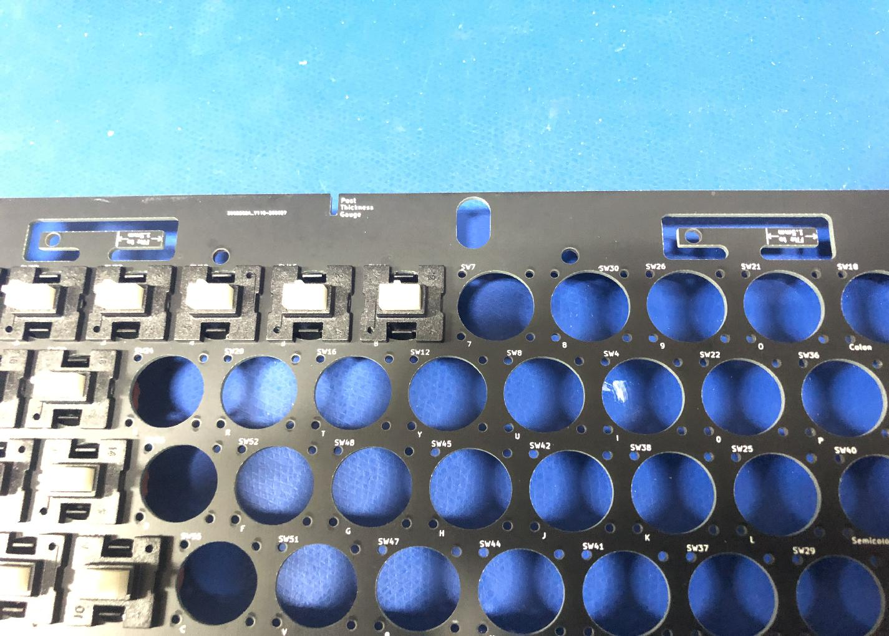

1. Remove both posts from the PCB.  Newer revisions of the aligner board include perforations for easier break-away of the posts.

    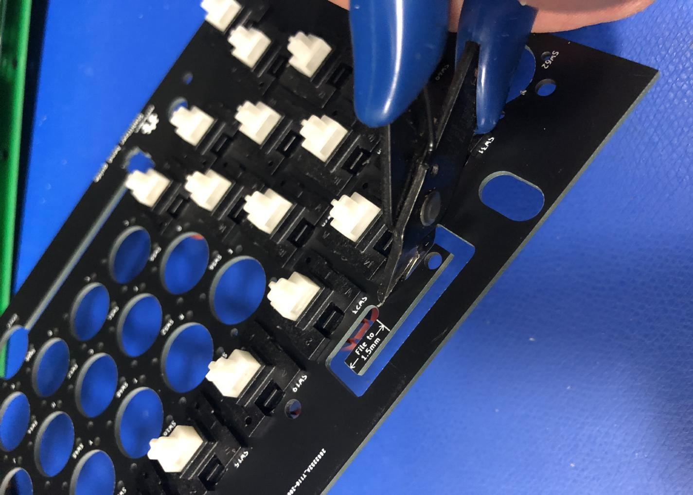

1. Be sure to file away any excess material from the breakaway tab.

    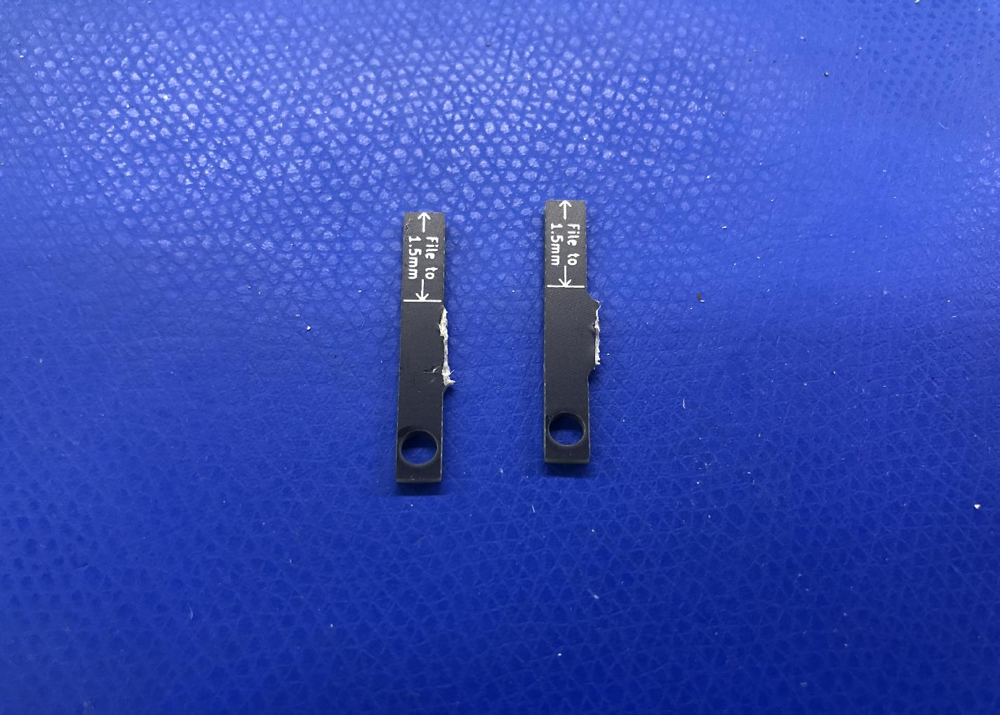 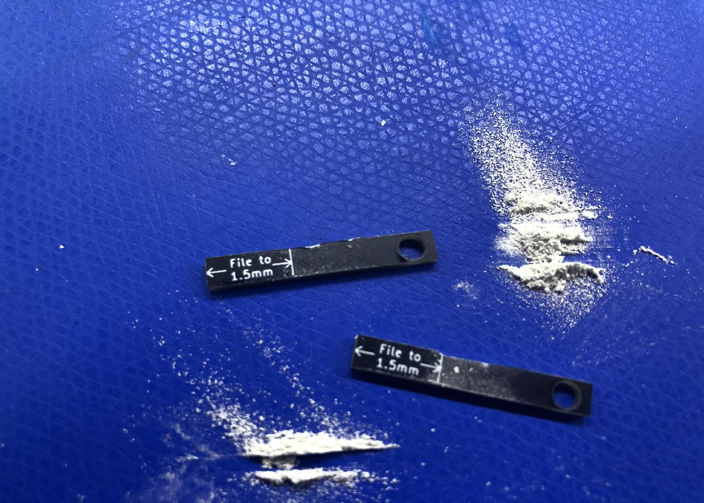

1. File away the area marked "File to 1.5mm".  The aligner includes a thickness gauge to test fitting, but it turns out that manufacturing tolerances are not adequate, and the gauge is not reliable.  Use a spare key cap to test the thickness.  The post should require some pressure to inert into the keycap base.

1. The post should be just under 4mm wide.  The post in this example is an early revision that was specified at 4mm, and ended being a sliver too wide to fit the keycap base.  It required a alittle extra filing along one side to fit properly.  The posts on newer revs are thinner and should not require extra filing to narrow side-to-side width.

    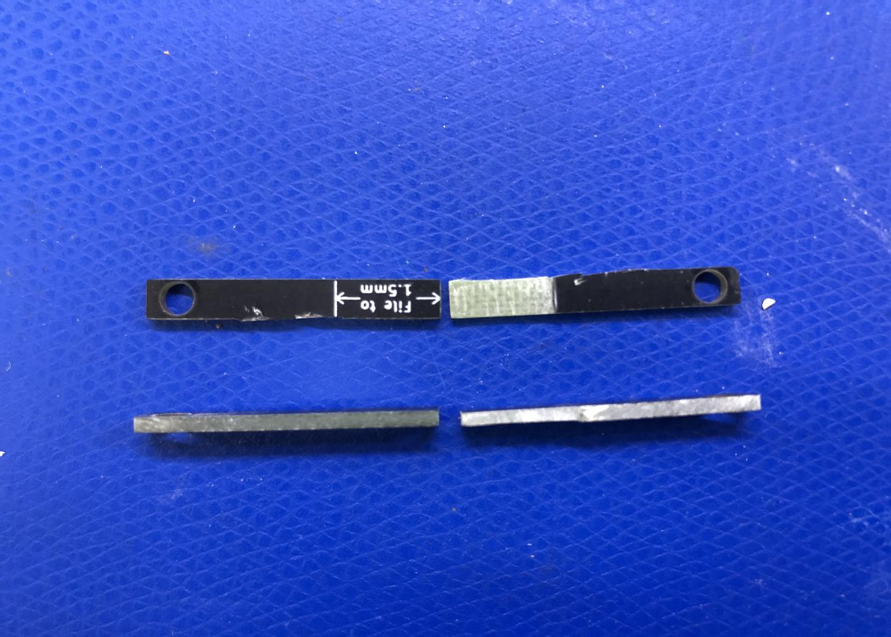

    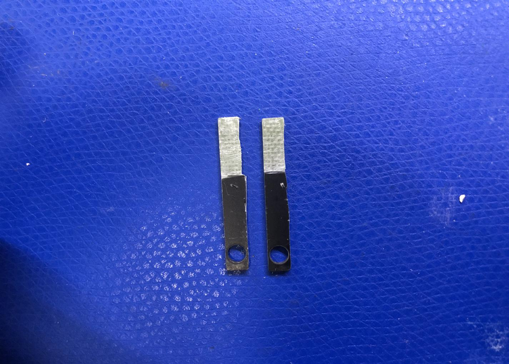

1. The posts should be just tight enough to require a pair of pliers to insert.  Use pliers to insert both posts fully.  Use a ruler or caliper to ensure the prodruding portions of both posts are the same length.

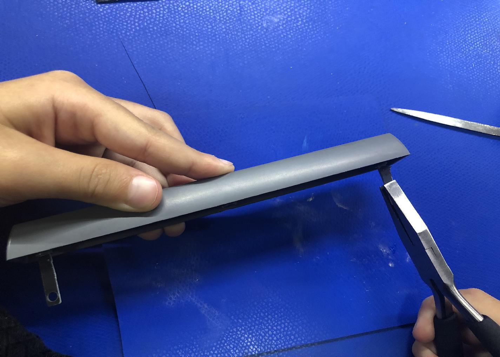

1. Install the spacebar center mount on the spacebar key, aligning the posts so that they slide into the PCB-mounted stabilizers.

1. Holding down the spacebar, align the arms stabilizer rod with the holes in the posts, and then snap the rod into place at the front of the stabilizer mounts.

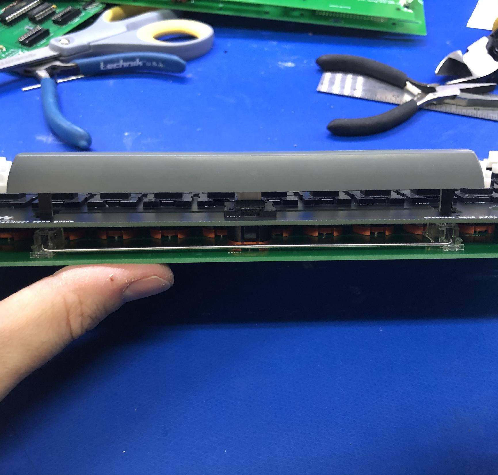

