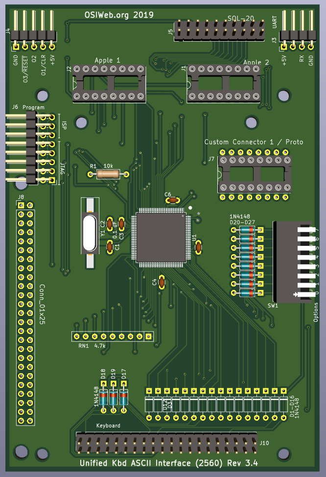

# ASCII Interface - Atmega2560

This is is a key scanner module with parallel output, and optional serial
output, supporting keyboards of up to 16 rows X 8 columns.  This design uses the ATMega2560, since it's an easy port from the ATMega328P, which was initially selected for the sole reason of being familiar to hobbyists. The 2560 has much more I/O, which simplifies the design, assembly, and firmware, and opens up some additional possibilities. 

## Features
- Parallel or serial output
- Up to 8 configuration settings via an up-to-8 position DIP switch
- Apple 1, Apple 2, and SOL-20 compatible outputs. Other configurations can be
  supported by making a custom cable.
- Can decode arbitrary keyboards up 16 rows by 8 columns.
- Supports up to 3 keyboard LEDs
- Supports up to 3 "special" host outputs, such as RESET, SCREEN_CLEAR, BREAK, etc.

## Differences from ATMega328P version
- Backward compatible with the ATMega328P version, with following enhancements:
1. The Output2 can be a regualar TTL, open-collector, or open-emitter. In the
   328P version, changing between regulary TTL output and open-collector on
   Output2 required changing an IC.
1. The serial port no longer shares lines with the parallel output port, so both
   serial I/O and parallel output can be used at the same time without risk of
   conflict. However, serial I/O is not yet supported in the firmware.
1. Because the rows are no longer driven by a 4-to-16 decoder circuit, and the
   columns are no longer read via a shift register, the row and column lines can
   be used for both input and output, which allows this board to interface with
   OSI keyboards directly (not yet supported in firmware).
   
## Overview
- Two GPIO ports are used to drive the row outputs, and one GPIO port is used to
  read the columns.
- One 8-bit port is used for the parallel ASCII output.
- Three GPIO lines are used to generate special outputs to the host. These could
  be RESET, BREAK, CLEAR, etc. These may be configured as open-collector (Hi-Z
  for HI, GND for LO), or open-emitter (5V for high, Hi-Z for LO).
- Three GPIO lines are used to control keyboard LED, or other keyboard functions.
- The DIP switch is wired into row 8 (of 0-15), to reduce RAM usage and speed up
  key scanning.
- A serial (UART) port is provided. This could be used to provide serial output
instead or parallel output, to support a bootloader, or even to accept a serial
input stream from another source to send to the host as parallel ASCII data.

## Assembly Notes

1. Solder the surface-mount microcontroller first. Be sure to match pin 1 to the
   dot on the silk-screen layer.
1. Next, install the surface mount crysta, Y1.  The orientation is not important.
1. Next, solder in the Diodes D1-D3 and D4-D11
1. Do not populate diodes D12-D27. These diodes are jumpered short. If you are
   using a key matrix with no diodes, then cut the jumpers with an x-acto knife
   and populate the diodes.
1. Install all the capacitors. These are all 0.1 uF ceramic capacitors with 0.1"
   lead spacing. Many capacitors with 0.2" lead spacing are actually 0.1"
   emerging from the body, bent to 0.2", and can be straightened back to 0.1".
1. Next, solder in the resitor R1 and Resistor network RN1.
1. Install DIP switch SW1.
1. Install connector J7 
1. Install the In-circuit Serial Programming (ISP) header, J6. (right-angle, 2x3
   0.100")
1. (Optional) If you will be the digital outputs, or if you will be attaching
   switches or other sources of open-collector signals (such as RESET), then
   install connector J4 (right-angle, 1x5 0.100")
1. (Optional) If you will be using the serial port, install the serial header
   J3. (right angle, 1x4 0.100")
1. If you will be using the Apple 1 connector, install the DIP socket J1 (16-pin
   dip). If you plan to insert and remove the cable many times, a dual-wipe
   socket may be preferable to machine-pin, since it has a lower insertion
   force, and you will be less likely to bend pins. If you plan to insert the
   cable once and leave it forever, I suggest a machine-pin DIP socket.
1. If you will be using the Apple 2 connector, install the DIP socket J2 (16-pin
   dip).  The note for the Apple 1 connector selection applies here as well.
1. If you will be using the SOL-20 connector, install connector J5 (vertical
   2x10 0.100")

configuration or only a serial configuration, then you can jumper these
resistors with a piece of wire.
1. Any connectors required.

## Optional components
### Diodes D1-D16
These diodes are intended to prevent conflicts between high and low keyboard
driver outputs. They allow the row drivers to pull rows low, but not high,
emulating open collector outputs.

If you are attaching a keyboard with no diodes, then you only need to populate
the diodes corresponding to rows on the keyboard. If the keyboard has 8 rows,
then you may want to install 8 diodes corresponding to those rows.

Note that the footprints for these diodes include a copper jumper on the TOP
copper layer. If you install any of these diodes, you should cut the jumpers for
those diodes. Otherwise the diodes do nothing.

If you are attaching a keyboard with a diode per key, then the diodes on the keys perform the same function, in addition to preventing "ghosting", so the per-row diodes do not need to be installed.

