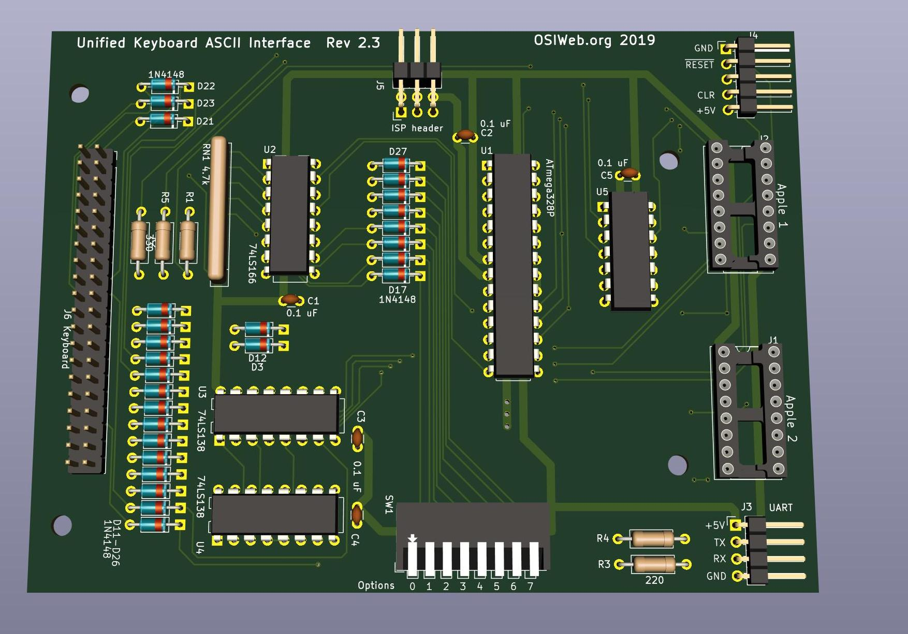

# ASCII Interface - Atmega328p

This is is a key scanner module with parallel output, and optional serial
output, supporting keyboards of up to 16 rows X 8 columns.

The ATMega 328P was selected for the sole reason that it is an architecture
familiar to many hobbyists, with an accessible programming environment and
ecosystem, in a DIP format that fits the retro look and is easy to solder for
most hobbyists. All of the ICs, other than the microcontroller, are only present
to compensate for the limited number of GPIO lines on this small 28-pin
microcontroller. Using a bigger chip would greatly simplify the hardware and
even slightly simplify the hardware layer of the firmware.

## Features
- Parallel or serial output
- Up to 8 configuration settings via an up-to-8 position DIP switch
- Apple 1, Apple 2, and SOL-20 compatible outputs. Other configurations can be
  supported by making a custom cable.
- Can decode arbitrary keyboards up 16 rows by 8 columns.
- Supports up to 3 keyboard LEDs
- Supports up to 3 "special" host outputs, such as RESET, SCREEN_CLEAR, BREAK, etc.

## Overview
- The keyboard rows are driven by a pair of 74LS138 decoders, allowing 4 GPIO
  lines to drive 16 rows.
- The columns are read in via an 8-bit shift register, controlled by 3 GPIO lines.
- One 8-bit port is used for the parallel ASCII output.
- Three GPIO lines are used to generate special outputs to the host. These could
  be RESET, BREAK, CLEAR, etc. Two of these may be configured as emulated
  open-collector drivers.
- Three GPIO lines are used to control keyboard LEDs. 

- The DIP switch is wired into row 15 (last row) of the matrix. In the future,
the DIP switch will be moved to row 9 to reduce RAM usage and speed up key scanning.

- The top two parallel I/O bits can also be configured as UART I/O. This could
be used to provide serial output instead or parallel output, to support a
bootloader, or even to accept a serial input stream from another computer to
send to the host as parallel ASCII data. This last application would require
careful timing to avoid conflicts.

## Assembly Notes

The minimum functioning circuit includes 
1. the Microcontroller (U1)
1. the 74LS166 shift register (U2)
1. one 74LS138 decoder (U3). This means no DIP switch, so keymap must be
   selected at firmware build.
1. The resistor network RN1
1. The two resistors R3 and R4. If you are using the keyboard in only a parallel
configuration or only a serial configuration, then you can jumper these
resistors with a piece of wire.
1. Any connectors required.

## Optional components
### Diodes D1-D16
These diodes are intended to prevent conflicts between high and low keyboard
driver outputs. They allow the row drivers to pull rows low, but not high,
emulating open collector outputs.

If you are attaching a keyboard with no diodes, then you only need to populate
the diodes corresponding to rows on the keyboard. If the keyboard has 8 rows,
then you may want to install 8 diodes corresponding to those rows.

Note that the footprints for these diodes include a copper jumper on the TOP
copper layer. If you install any of these diodes, you should cut the jumpers for
those diodes. Otherwise the diodes do nothing.

If you are attaching a keyboard with a diode per key, then the diodes on the keys perform the same function, in addition to preventing "ghosting", so the per-row diodes do not need to be installed.

### DIP switch and associated diodes
The DIP switch is optional. If you don't want to be able to set options via the
DIP switches, you can set all your preferences in the firmware, or just accept
the default behavior, and skip the DIP switch and Diodes D17-D20 and D24-D27.

### Second 74LS138 multiplexer (U4)
Only needed if you have more than 8 rows (including the DIP switch).

### The 74LS07 hex buffer (U5) and pullup R6
The 74LS07 is only needed if you are using LED2 or LED3 on the keyboard, or the OUT2 open
collector output.

### Diodes D21, D22, D23
Some keyboards may not wire all keys into the matrix. For example, some other
interface modules may assign special hardware functions to certain keys. Those
keys are brought directly to the keyboard connector. For the classic keyboard,
the POWER key, the '@' key, and the RUBOUT key are not directly wired. This
module wires them into the matrix via D21, D22, and D23, respectively. For
keyboards with no separately wired keys, these diodes may be omitted.

### Resistors R1, R2, R5
These resistors provide current limiting for up to three keyboard LEDs. If no
keyboard LEDs are installed, then these resistors can be ommitted.
