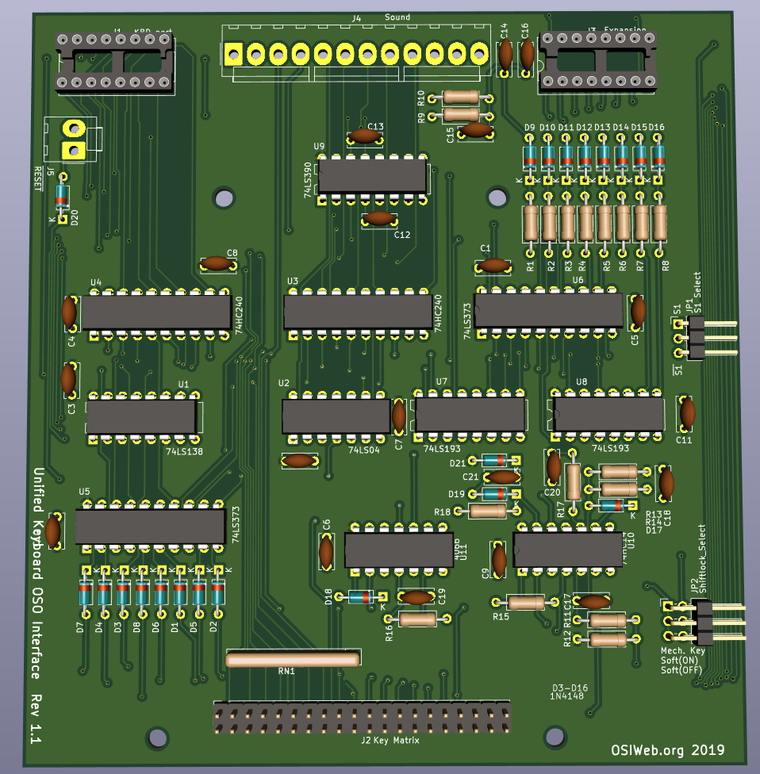

* OSI Compatible interface

An interface for OSI computers that is compatible with the OSI 542C keyboard, including sound circuits.  

This interface also permits substitution of a soft-shiftlock function using 
a regular momentary keyswitch, instead of the hard-to-fine latchine keyswitch.
An LED is provided to indicate SHIFT LOCK status.  This interface mates with
the Classic ASCII keyboard, configured with the OSI keycaps.  

**Construction Notes:

1. If a diode per key is installed on the keyboard, then omit diodes D1-D8 and install D18.

1. If the keyboard is not installed with a diode per key, then install D1-D8, and omit D18.

1. The RESET delay is about 3 seconds with a 6.8 uF capacitor at C20.  4.7 uF gives about
2 seconds, and 3.3 uF gives about a 1 second delay.

1. If you want to use the sound circuit with an older 540A video board, then jumper pin 13
of IC E4 to pin 15 of the keyboard connector, and set JP1 to "S1".

1. If you use a 540B video board, then set JP1 to "/S1"

