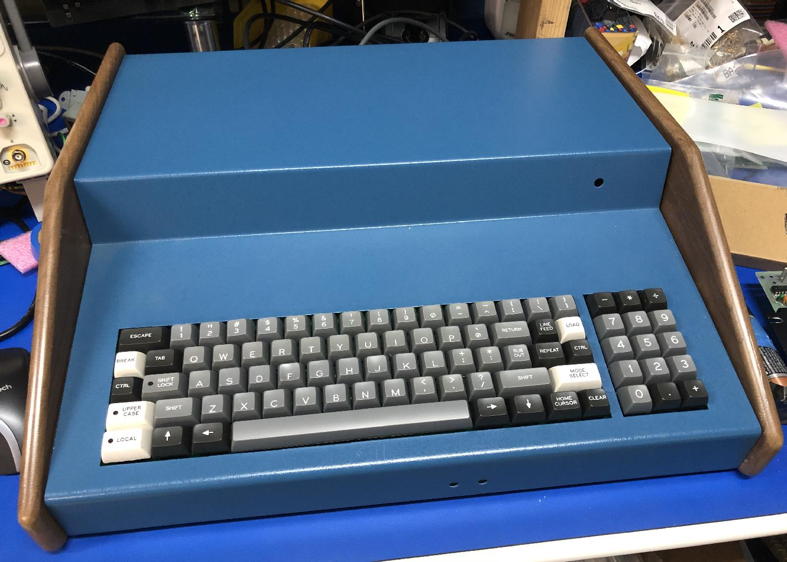

# SOL keyboard

This keyboard replicates the keyboard on the SOL-20.

This keyboad matrix works with one of the add-on ASCII encoders from this
project, which must be separately built or acquired.

This keyboard has a sibling Sol-20 keyboard with integrated
encoder [(here)](../keyboard-sol-integrated). The two keyboards are identical except for the following difference:

1. The integrated version places the connector closer to the main board keyboard
   socket, so the original cable fits more easily.

1. This non-integrated version requires a piggy-back encoder board. When
   installing in a Sol-20, this piggyback board must be mounted on the right
   side of the keyboard, and connected with a cable, to avoid mechanical
   interference from the Sol main board.
   
1. The piggy-back encoder permits use with other machines, via the Apple-1 and
   Apple-2 sockets, and two different user-configurable headers.
   
1. The piggy-back encoder also includes a UART interface.

The keyboard is designed using KiCad in order to be the most useful for anybody
wishing to modify the keyboard for more specific uses, or to add to the project.

The keyset for the SOL-20 keyboard consists of the Unified Keyboard Project
classic ASCII keyset, with a special SOL-20 add-on keyset.

## Differences from the original include:

1. The original keyboard is a capacitive keyboard. This keyboard uses standard
   switches (either Cherry or Futaba).
   
1. The original keycaps have an 11 degree angled stem. It may be possible to
   find such keycaps, but I was unable to find any. It also may be possible to
   create 11 degree adapters. But this keyboard uses straight keycaps. I have
   tried both styles, and do not find a difference in typing comfort or speed,
   althought there is an aesthetic difference. There is s tiny bit of space
   between keys using straight keycaps, so an 11 degree adapter may not require
   any change to the layout.
   
   
1. The original uses UPPERCASE+REPEAT to reset the system. For technical
   reasons, this version uses CTRL+MODE_SELECT to RESET the system. 

