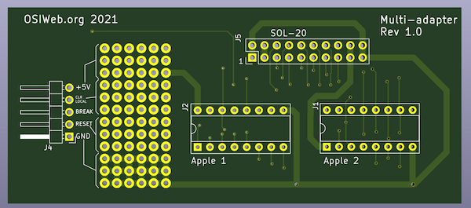

# Unified Keyboard Project Multi Adapter

This is a keyboard adapter to permit use of Apple 1, Apple 2, and Sol-20
compatible keyboards with any of these three computers.

## Notes
- Protoboard-style pad matrix permits flexible choice of on-board RESET and CLEAR (OR
  LOCAL) switches.
- Pin header allows external RESET and CLEAR (or LOCAL) switches
- Note that the SOL and Apple keyboards have different strobe polarity. Make
  sure the strobe polarity on the keyboard is properly configured.

